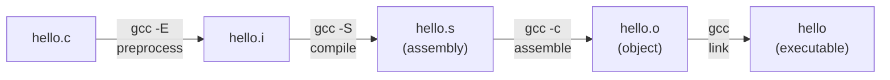

# Day 1: Source to Binary

## What You'll Learn Today

What actually happens when you compile a C program, and how to read the result without running it. By the end of today, `file`, `readelf`, and `objdump` will feel like useful tools, not walls of hex.

## Core Concepts

### The Compilation Pipeline

When you write C and hit "compile," four things happen in sequence:



1. **Preprocess**: `#include` and `#define` get expanded (text substitution)
2. **Compile**: C becomes assembly (human-readable machine instructions)
3. **Assemble**: assembly becomes machine code (binary, one `.o` file per source file)
4. **Link**: multiple `.o` files get combined into one executable, with library references resolved

### What's an ELF?

The executable you get on Linux is an **ELF** (Executable and Linkable Format). It's not just raw instructions. It's organized into **sections**:

- **`.text`**: the actual instructions (your compiled code)
- **`.data`**: initialized global/static variables
- **`.bss`**: uninitialized globals (exists at runtime but takes no space on disk)
- **`.rodata`**: read-only data like string literals (`"Hello, world!"`)

### Reading a Binary Without Running It

Four commands that tell you what's inside:

- `file ./program`: what kind of binary is this? (ELF? 64-bit? dynamically linked?)
- `strings ./program`: dump every printable string embedded in the binary. String literals, error messages, passwords left in the code by mistake. If a developer hardcoded a secret, `strings` will find it
- `readelf -S ./program`: list all sections and their sizes
- `objdump -d ./program`: disassemble it (show the machine code as assembly)

## Hands-On

### 1. Compile and Inspect

Create `hello.c`:
```c
#include <stdio.h>

const char *greeting = "Hello from NJACK!";

int main() {
    printf("%s\n", greeting);
    return 0;
}
```

Compile and inspect:
```bash
gcc -o hello hello.c
file hello
strings hello
readelf -S hello
objdump -d hello | head -80
```

Find:
- The **entry point**: which section is it in?
- Which section holds the **instructions** your code compiled to
- Which section holds the **string literal** `"Hello from NJACK!"` (check: does `strings hello` show it?)
- What else shows up in the `strings` output? Most of it is linker metadata, but your string is in there too

### 2. See Each Stage

You can stop the compiler at each stage to see what's happening:

```bash
gcc -E hello.c -o hello.i     # preprocessed (still C, but expanded)
gcc -S hello.c -o hello.s     # assembly
gcc -c hello.c -o hello.o     # object file (machine code, not yet linked)
gcc    hello.c -o hello       # final linked executable
```

Compare the sizes. Look at `hello.s`. That's what your C became before it turned into binary.

### Stretch (Optional)

Paste your `hello.c` into [godbolt.org](https://godbolt.org/). Toggle between `-O0` (no optimization) and `-O2` (optimized). Watch how the compiler reshapes even simple code.

## Resources

- [Compiler Explorer (godbolt.org)](https://godbolt.org/)
- `man readelf`, `man objdump`
- CS:APP ch. 7 (linking and ELF basics), for anyone who wants to go deep
