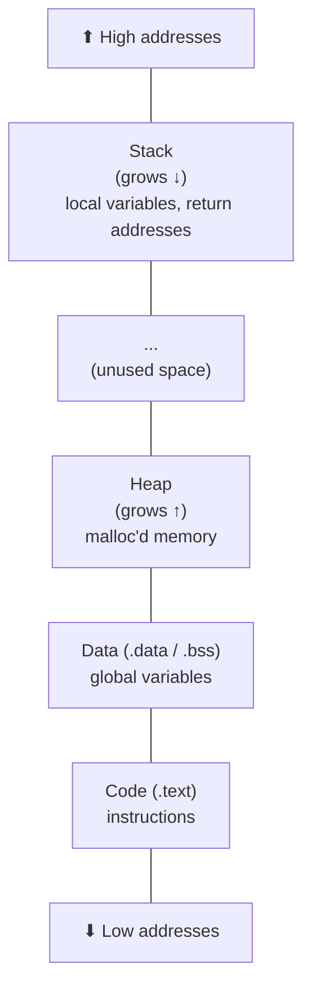

# Day 2: Memory and the Stack

## What You'll Learn Today

How memory is laid out when a program runs, what the stack actually is, and what happens at the register level when one function calls another. By the end of today, you'll watch a return address sit on the stack in gdb. The same mechanism you'll exploit on Day 6.

## Core Concepts

### Process Memory Layout

When a program runs, the OS gives it a virtual address space divided into regions:



- **Code (`.text`)**: the instructions (read-only, executable)
- **Data (`.data` / `.bss`)**: global and static variables
- **Heap**: dynamically allocated memory (`malloc`), grows upward
- **Stack**: function-local variables and call bookkeeping, grows downward

### Registers That Matter

You don't need to memorize all registers. For now, these four:

| Register | Purpose |
|---|---|
| `rip` | Instruction pointer: the address of the next instruction to execute |
| `rsp` | Stack pointer: the current top of the stack |
| `rbp` | Base pointer: the bottom of the current stack frame |
| `rax` | Return value: where a function puts its result |

### What a Function Call Actually Does

When `outer()` calls `inner()`:
1. Arguments are placed in registers (or pushed to the stack)
2. `call inner` pushes the **return address** (the instruction after the `call`) onto the stack
3. `inner` runs
4. `ret` pops the return address off the stack and jumps back

The return address is just data sitting on the stack. This becomes important on Day 6.

## Hands-On

### 1. Compile and Debug

Create this program:
```c
int inner(int x) {
    return x + 1;
}

int outer(int y) {
    int z = inner(y);
    return z * 2;
}

int main() {
    int result = outer(5);
    return result;
}
```

Compile and open in gdb:
```bash
gcc -O0 -g -o calls calls.c
gdb ./calls
```

> **macOS?** Use `lldb ./calls` instead. Set a breakpoint with `b inner`, run with `r`, examine the stack with `memory read -count 20 -format x -size 8 $rsp`, and backtrace with `bt`.

### 2. Watch the Stack

In gdb:
```
break inner
run
x/20xg $rsp
```

This shows you 20 quad-words starting from the top of the stack. You'll see:
- The return address (pointing back into `outer`)
- The saved base pointer
- Local variables

Type `bt` (backtrace) to see the full call chain: `main` calls `outer` calls `inner`.

### 3. Step Through

```
info registers rip rsp rbp rax
ni
info registers rip rsp rbp rax
```

Watch `rip` advance. When `inner` returns, watch `rsp` change as the frame gets popped.

## Resources

- LiveOverflow, "Binary Exploitation" playlist
- CS:APP ch. 3, machine-level representation and calling conventions
