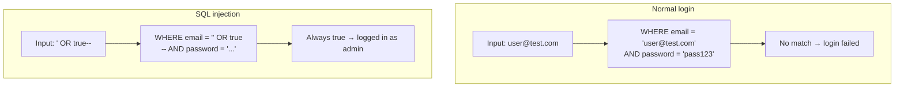

# Day 2: Web App Security Basics

## What You'll Learn Today

The three most common ways web apps break. You'll exploit a real (intentionally vulnerable) app today: SQL injection to bypass a login, XSS to inject a script, and broken access control to see data you shouldn't.

## Core Concepts

### Why Apps Break

Web apps take input from users (forms, URLs, search boxes) and use it to build database queries, render pages, or look up records. When the app trusts that input without checking it, attackers can make it do things it was never meant to do.

### SQL Injection (SQLi)

A login form builds a database query from your email and password. If the app concatenates your input directly into the query without sanitizing it, you can inject SQL that changes the query's logic.

The classic: typing `' OR true--` as the email makes the `WHERE` clause always true and comments out the password check. You're logged in as admin without knowing the password.



**What stops it:** parameterized queries. The database treats your input as data, never as SQL code.

### Cross-Site Scripting (XSS)

A page displays text you typed (a search term, a comment) without escaping it. If you type `<script>alert(1)</script>` and the page renders it as HTML, the script runs in every visitor's browser.

### Broken Access Control (IDOR)

The app shows your order at `/order?id=5`. What if you change it to `/order?id=6`? If the app never checks whether that order belongs to you, you can see someone else's data.

## Hands-On

### 1. Set Up Juice Shop

Use the [public demo](https://demo.owasp-juice.shop/) or run locally:
```bash
docker run -d -p 3000:3000 bkimminich/juice-shop
```

### 2. SQL Injection: Login Bypass

1. Go to the login page
2. Try a normal wrong login, note the error
3. Enter `'` as the email. You should get a different error (a database error). That's the signal
4. Enter `' OR true--` as the email, anything as the password
5. You're logged in as admin

Look at the query being built: `SELECT * FROM Users WHERE email = '' OR true--' AND password = '...'`. Your input broke out of the string and changed the logic.

### 3. XSS: Script Injection

Find a search box or input field that reflects your input on the page. Type a harmless script tag and see if it executes. The exact steps depend on the Juice Shop version; look for the search bar.

### 4. IDOR: Access Control

While logged in, find a URL with a numeric ID (like a basket or order number). Change the number. Can you see another user's data?

## Resources

- [OWASP Juice Shop](https://owasp.org/www-project-juice-shop/)
- [OWASP Top 10](https://owasp.org/www-project-top-ten/), skim the summaries
- [PortSwigger Web Security Academy](https://portswigger.net/web-security), SQLi topic
