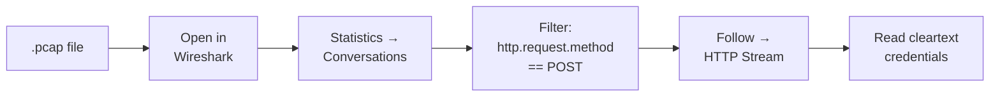

# Day 4: Taste: Forensics

## What You'll Learn Today

How to read captured network traffic. You'll open a packet capture file in Wireshark, filter it, follow a conversation, and pull cleartext credentials out of it. This is what forensics looks like at the network level.

## Core Concepts

### What's a .pcap?

A `.pcap` (packet capture) file is a saved recording of network traffic, every packet that crossed the wire during the capture window. Wireshark lets you open it, filter it, and reconstruct what happened.

### The Forensics Workflow

1. **Narrow first**: `Statistics → Conversations` shows you who talked to whom and how much data moved. Start here, not by scrolling through thousands of packets.
2. **Filter**: type `http` in the filter bar to see only HTTP traffic. Add specifics: `http.request.method == "POST"` to find form submissions.
3. **Reconstruct**: right-click a packet → `Follow → HTTP Stream` to see the full conversation as readable text.

### Why This Works

Cleartext protocols (HTTP, FTP, Telnet) send everything, including passwords, as plain text. Anyone capturing traffic on the same network can read it. This is why HTTPS exists.

## Hands-On

### 1. Open the Provided .pcap

Download the `.pcap` from the challenge's attachment on the CTFd scoreboard (link in Discord) and open it in Wireshark. Both today's questions use this same file.

### 2. Find the Login

1. Filter by `http`
2. Look for a `POST` request, that's likely the login form submission
3. Right-click it → `Follow → HTTP Stream`
4. Read the stream. The username and password are right there in cleartext

### 3. Export an Object (Stretch)

`File → Export Objects → HTTP`. Wireshark can pull out files (images, HTML pages, downloads) that were transferred in the capture, reconstructing them from the raw packets. Export one, then actually open it and look inside — the contents that crossed the wire are now a file on your disk. (You can also `sha256sum` it to confirm it matches what was sent.)

## Resources

- [Wireshark User's Guide](https://www.wireshark.org/docs/wsug_html_chunked/)
- [Wireshark Sample Captures](https://wiki.wireshark.org/SampleCaptures)
- [picoGym Forensics](https://play.picoctf.org/)
- [CyberDefenders](https://cyberdefenders.org/)
