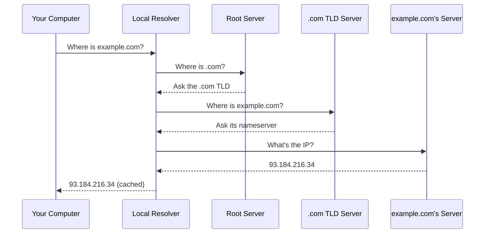

# Day 5: Networking & DNS Fundamentals

## What You'll Learn Today

How the internet actually routes your traffic: DNS, TCP vs. UDP, firewalls, VPNs, and proxies. You'll use real tools (`dig`, `ping`, `traceroute`) to see this infrastructure in action.

## Core Concepts

### DNS: the internet's phonebook

When you type `example.com`, your browser doesn't know where that is. DNS turns the domain name into an IP address (like `93.184.216.34`) so your browser can connect.

The lookup travels through a chain: your local resolver → root servers → TLD servers → the authoritative server for that domain. The result gets cached so the next lookup is instant.



### TCP vs. UDP

- **TCP**: reliable, ordered delivery. Used for web pages, email, file transfers. If a packet drops, it's resent.
- **UDP**: fire and forget. Used for DNS lookups, video streaming, gaming. Faster, but no guarantee every packet arrives.

### Firewalls, VPNs, and Proxies

- **Firewall**: a bouncer checking IDs at the door. Blocks traffic that doesn't match its rules.
- **VPN**: an encrypted tunnel your traffic travels through. Your ISP sees encrypted data going to the VPN server, not where you're actually going.
- **Proxy**: a stand-in who fetches things on your behalf. The destination sees the proxy's IP, not yours.

### Why DNS Answers Aren't Verified by Default

A DNS response is just a UDP packet that says "this domain is at this IP." Without verification (DNSSEC), anyone who can inject a faster response can redirect your traffic. You'll see an example of this in a pre-made packet capture, a spoofed DNS response next to a normal one.

To tell a forged response from a real one, compare the two packets field by field. The fields worth checking: the **transaction ID** (must match the query; a mismatch or a duplicate is suspicious), the **answer IP** (does it point where you'd expect?), the **TTL** (spoofed answers often use an odd value), and the **source** the packet claims to come from. Wireshark shows all of these when you expand the DNS layer of each packet.

## Hands-On

### 1. DNS Lookups

Pick 3 websites you use. Run these for each:
```bash
dig example.com
ping example.com
traceroute example.com
```

Note the IP returned and the round-trip time. Different sites, different IPs, different paths.

### 2. MX Records

Run `nslookup -type=MX <domain>` on one of your sites. This shows the mail server, a different kind of phonebook entry than the website's IP.

### 3. Spot the Spoofed DNS (Provided Exhibit)

You'll be given a pre-made packet capture showing a spoofed DNS response next to a normal one. Open it in Wireshark and find the field that gives the fake one away.

### Stretch: VPN IP Check

1. Go to an IP-lookup site (e.g., whatismyipaddress.com) and note your public IP
2. Connect to a free/test VPN (e.g., [ProtonVPN free tier](https://protonvpn.com/free-vpn))
3. Check your IP again. It's different. That's the VPN working.

## Resources

- [Cloudflare: What is DNS?](https://www.cloudflare.com/learning/dns/what-is-dns/)
- [Cloudflare: What is a firewall?](https://www.cloudflare.com/learning/security/what-is-a-firewall/)
- `man dig`, `man ping`
