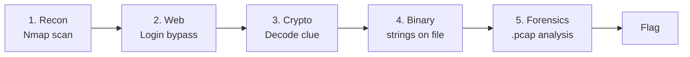

# Day 7: Joint Capstone

## What Today Is

Both tracks, Computers and Internet, come together for one guided, multi-stage challenge. You'll go from recon to web exploitation to crypto to binary analysis to forensics to a final flag.

This is a victory lap, not a wall. Hints are available at every stage. The goal is everyone finishing and seeing how the pieces connect across both tracks.

## Pair Up

Find a partner from the other track. The capstone uses skills from both sides. Pairing up is the point, not a shortcut.

## The Challenge

Work through these stages in order:

### Stage 1: Recon (Internet Track, Day 6)
Scan the capstone server with Nmap. Identify what's running and find the web service.

### Stage 2: Web (Internet Track, Day 2)
Visit the web app. Find the planted vulnerability (a login bypass you've seen before) to uncover an encoded clue.

### Stage 3: Crypto (Internet Track, Day 3)
Decode the clue using CyberChef or Python, the same techniques from Day 3.

### Stage 4: Binary Analysis (Computers Track, Day 5)
The decoded clue is a filename. Download that binary from the server. Reverse it (`strings` is enough) to extract a credential.

### Stage 5: Forensics (Internet Track, Day 4)
Use the credential to identify the right session in a provided `.pcap`. Follow the HTTP stream to find the final flag.

## Resources

Everything from Days 1-6, plus:

**Where to go next after this week:**
- **Web security** → [PortSwigger Web Security Academy](https://portswigger.net/web-security)
- **Cryptography** → [CryptoHack](https://cryptohack.org/)
- **Forensics** → [CyberDefenders](https://cyberdefenders.org/)
- **Binary exploitation** → [pwn.college](https://pwn.college/)
- **Reverse engineering** → [LiveOverflow](https://www.youtube.com/c/LiveOverflow)
